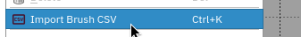
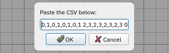

# tiled-import-csv

This simple extension adds a `Import Brush CSV (Ctrl+K)` action to the
Edit menu, which can be used to import a brush layer using a CSV string.

Made for the [Tiled Map Editor](https://www.mapeditor.org/), and intended to be used with
external 3rd-party tools.

GitHub repository: https://github.com/luxmiyu/tiled-import-csv.

## Installation

Download the `import-csv.js` and `import-csv.svg` files and place them in the `extensions`
folder of your Tiled installation.

To find this folder, in Tiled, navigate to Edit -> Preferences -> Plugins, and find the "Open"
button in the Extensions panel.

For example: `"/home/$USER/.config/tiled/extensions/"`.

## Usage

Navigate to Edit -> Import Brush Layer CSV (or press Ctrl+K by default).



Paste the CSV into the prompt, and hit OK.



The CSV must be a comma-separated grid of tile IDs, for example:

```csv
0,1,0,1,0,1,0,1
2,3,2,3,2,3,2,3
0,1,0,1,0,1,0,1
2,3,2,3,2,3,2,3
```

**You must have a tileset already selected**, this CSV will replace your current brush layer.
